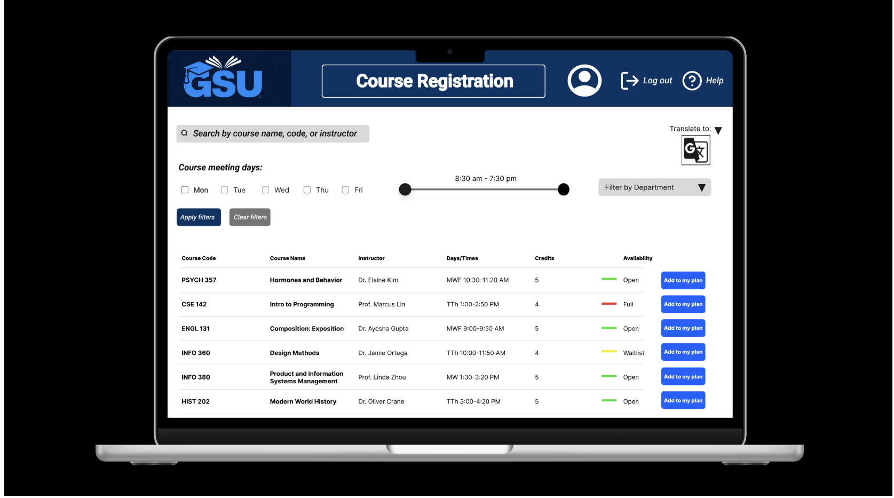

## Modernizing University Course Registration System

This documentation presents a product management case study exploring improvements to university course registration workflows.

The project includes stakeholder research, requirements analysis, workflow modeling, and proposed product solutions.

## My Contributions

This project was completed collaboratively as part of INFO 380. My primary contributions included:

- Developing the executive summary, problem statement, and current state analysis to define product goals and stakeholder needs.
- Conducting research synthesis and analysis documentation to inform product direction.
- Creating and documenting wireframes and user interface concepts aligned with user needs.
- Supporting the development of Objectives and Key Results (OKRs) and product strategy artifacts.
- Defining architecture considerations and non-functional requirements.
- Producing product planning documentation including prioritization, roadmap development, and iteration planning.
- Documenting risks, assumptions, and dependencies to support project feasibility analysis.
- Organizing and structuring the project wiki to support clear communication and navigation.

👉 [View Executive Summary](Executive-Summary/)

---

<em>Search and Filter Courses interface designed to improve course discovery through filtering, accessibility features, and multilingual support.</em>

## 📊 Executive Overview

- [Executive Summary](Executive-Summary.md)
- [Problem Statement Draft](Problem-Statement-Draft.md)
- [Solution Vision](Solution-Vision.md)
- [Out of Scope](Out-of-Scope.md)

---

## 🧠 Research & Analysis

- [Initial Research and Analysis Summary](Initial-Research-and-Analysis-Summary.md)
- [Current State Analysis](Current-State-Analysis.md)
- [Stakeholder Analysis](Stakeholder-Analysis.md)
- [Roles and User Needs](Roles-and-User-Needs.md)
- [References](References.md)

---

## 🗺  Product Strategy & Planning

- [Objectives and Key Results](Objectives-and-Key-Results.md)
- [Benefits and Features](Benefits-and-Features.md)
- [Prioritization, Roadmap, and Initial Iterations](Prioritization,-Roadmap,-and-Initial-Iterations.md)
- [Roadmap](Roadmap.md)

---

## 🏗  Requirements & Architecture

- [Architecture (Non-Functional) Requirements](architecture-non-functional-requirements/)
- [Data Flow Diagram](Data-Flow-Diagram.md)
- [Workflow Diagrams](Workflow-Diagrams.md)

---

## 🎨 Design

- [User Interfaces (Wireframes)](wireframes/)

---

## ⚙ Project Management

- [Risks, Assumptions, and Dependencies](Risks,-Assumptions,-and-Dependencies.md)

